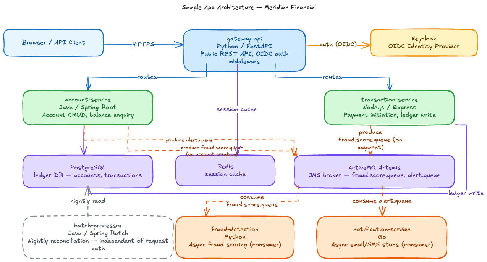

# Meridian Financial — Datadog Observability Sample App

A hands-on observability learning environment built on a realistic financial platform, modeling the fictional customer **Meridian Financial**. Six microservices spanning Python, Java, Node.js, and Go — pre-wired for Datadog but shipping with all instrumentation **commented out** so engineers can enable each layer progressively.

> Something not working? See **[TROUBLESHOOTING.md](./TROUBLESHOOTING.md)** for a layer-by-layer diagnostic model (Infrastructure → Application → Identity → Instrumentation → Telemetry → Backend) instead of chasing symptoms.

---

## Architecture

```
                     ┌──────────────────────────────────────────────────────┐
                     │              traffic-generator (in-cluster)           │
                     │    Continuous realistic load — always running         │
                     └────────────────────────┬─────────────────────────────┘
                                              │
                     ┌────────────────────────▼─────────────────────────────┐
                     │                  NGINX (reverse proxy)                │
                     └────────────────────────┬─────────────────────────────┘
                                              │
                     ┌────────────────────────▼─────────────────────────────┐
                     │            gateway-api  (Python / FastAPI)            │
                     │          REST API · OIDC auth middleware · :8080      │
                     └──────────────────┬───────────────────┬───────────────┘
                                        │                   │
          ┌─────────────────────────────▼──┐   ┌───────────▼────────────────────┐
          │  account-service               │   │  transaction-service            │
          │  Java / Spring Boot · :8081    │   │  Node.js / Express · :8082      │
          │  Account CRUD · balance        │   │  Payment initiation · ledger    │
          └────────────────┬───────────────┘   └──────────┬─────────────────────┘
                           │  JMS → fraud.score.queue,     │  JMS → fraud.score.queue
                           │  alert.queue                  │
                           │                               │
                     ┌─────▼───────────────────────────────▼───────────────┐
                     │           ActiveMQ Artemis  (JMS 2.0 broker)         │
                     └────────────────┬──────────────────────┬──────────────┘
                                      │                      │
               ┌──────────────────────▼────┐    ┌───────────▼──────────────────┐
               │  fraud-detection (Python)  │    │  notification-service (Go)   │
               │  Async scoring consumer    │    │  Email / SMS stub consumer   │
               └───────────────────────────┘    └──────────────────────────────┘

                     ┌──────────────────────────────────────────────────────┐
                     │      batch-processor  (Java / Spring Batch)          │
                     │  Nightly reconciliation · end-of-day settlement       │
                     └──────────────────────────┬───────────────────────────┘
                                                │
                     ┌──────────────────────────▼───────────────────────────┐
                     │     PostgreSQL  (ledger DB)   Redis  (session cache)  │
                     └──────────────────────────────────────────────────────┘
```

Same architecture, rendered as a diagram:



---

## Services

| Service | Language | Port | Role |
|---|---|---|---|
| `gateway-api` | Python (FastAPI) | 8080 | Public REST API, OIDC auth, request routing |
| `account-service` | Java (Spring Boot) | 8081 | Account CRUD, balance enquiry, JMS producer |
| `transaction-service` | Node.js (Express) | 8082 | Payment initiation, ledger write, JMS producer |
| `fraud-detection` | Python | — | Async fraud scoring, JMS consumer |
| `notification-service` | Go | — | Async email/SMS stubs, JMS consumer |
| `batch-processor` | Java (Spring Batch) | — | Nightly reconciliation and settlement |
| `traffic-generator` | Python | — | In-cluster continuous load generator |

Supporting infrastructure:

| Component | Image | Purpose |
|---|---|---|
| PostgreSQL 15 | `postgres:15` | Primary ledger database |
| Redis 7 | `redis:7` | Session store and cache |
| ActiveMQ Artemis | `apache/activemq-artemis` | JMS 2.0 broker (mirrors IBM MQ / TIBCO patterns) |
| Keycloak 26 | `quay.io/keycloak/keycloak:26.0` | OIDC for gateway-api · SAML SSO for Datadog |
| NGINX | `nginx:1.25` | Reverse proxy · frontend dashboard |

---

## Prerequisites

The app runs on Kubernetes. You need either a local cluster or an AWS account — both are fully supported paths, pick whichever fits your setup.

### Option A — Local Kubernetes

| Tool | Install | Notes |
|---|---|---|
| **Docker Desktop** | Enable Kubernetes in Docker Desktop → Settings → Kubernetes | Simplest — images built locally are available in the cluster automatically. |
| **Rancher Desktop** | https://rancherdesktop.io | Good Docker Desktop alternative — images available automatically. |
| **kind** | `brew install kind && kind create cluster` | Kubernetes-in-Docker, popular for CI. |
| **k3d** | `brew install k3d && k3d cluster create finance` | k3s in Docker. Fast startup. |
| **minikube** | `brew install minikube && minikube start` | Feature-rich, good driver support. |

> **Image loading:** Docker Desktop / Rancher Desktop pick up locally built images automatically. Other tools need an explicit load step — see [Redeploy & Teardown](#redeploy--teardown).

> **Note:** Synthetic tests won't work against a local cluster unless you configure a private location — your cluster isn't reachable from Datadog's public testing infrastructure.

### Option B — AWS EKS

Additionally requires AWS CLI ≥ 2.x and an SSO profile (`aws configure sso`). See [Redeploy & Teardown → AWS EKS](#aws-eks).

### Common tools

Required for **both** local and AWS EKS — Terraform isn't just for AWS: it's also how you apply the Datadog resources (monitors, dashboard, synthetics, log pipeline) via `make tf-apply-dd`, regardless of where the app itself runs.

```bash
brew install kubectl helm terraform
kubectl version --client && helm version && terraform version   # >= 1.5
```

You also need a **Datadog account** with:
- API key: https://app.datadoghq.com/organization-settings/api-keys
- App key: https://app.datadoghq.com/organization-settings/application-keys

> ⚠️ **Application Key value, not Application Key ID.** The Application Keys page shows the **Key ID** in the main list — that's not what you want. Click into the key (or use the copy icon on a *newly created* key) to get the actual **key value**. Using the Key ID causes `401 Unauthorized` on every Terraform apply.

Add both to `.env` (copied from `.env.example` — git-ignored):
```bash
cp .env.example .env
# set DD_API_KEY and DD_APP_KEY
```

---

## Credentials

All credentials for local development are pre-set in `.env` and `deploy/kubernetes/base/02-secrets.yaml`. No manual substitution needed for the first run — just `make deploy-k8s`.

### Application credentials

| Component | What | Value | Used by |
|---|---|---|---|
| PostgreSQL | database | `ledger` | account-service, batch-processor |
| PostgreSQL | user | `finance` | account-service, batch-processor |
| PostgreSQL | password | `finance_dev_password` | account-service, batch-processor |
| ActiveMQ Artemis | user | `admin` | all JMS producers/consumers |
| ActiveMQ Artemis | password | `artemis_dev_password` | all JMS producers/consumers |
| Keycloak | admin user | `admin` | Keycloak admin console |
| Keycloak | admin password | `Finance@Admin2025!` | Keycloak admin console |
| Keycloak | finance realm client | `finance-gateway` | gateway-api, frontend dashboard |
| Keycloak | client secret | `FuX1ZIddFs02LzJT-s5MZufplT7SzGmflb42_6P8VcI` | gateway-api, frontend dashboard |

### Access URLs

| What | URL | Notes |
|---|---|---|
| **Finance dashboard** | `http://localhost:30080` | Login with any finance realm user below |
| **Keycloak admin console** | `https://localhost:30443/admin/master/console/#/finance` | Login as `admin` / `Finance@Admin2025!` |
| **Keycloak finance realm account** | `https://localhost:30443/realms/finance/account/` | Self-service account page for realm users |
| **ActiveMQ management console** | `kubectl port-forward svc/activemq-artemis 8161:8161 -n finance` then `http://localhost:8161` | Broker metrics and queue management (not proxied through nginx) |

> The Keycloak login flow hits a self-signed certificate — see [Miscellaneous](#miscellaneous) before your first login.

### Finance realm users and roles

Pre-imported into the `finance` Keycloak realm. Log in via the Finance dashboard at `http://localhost:30080` — it redirects to Keycloak automatically. All users share the password **`Finance@2025!`**.

| Username | Role | Dashboard capabilities |
|---|---|---|
| `alice.analyst` | `finance-analyst` | View accounts list · Check balances · Read-only |
| `bob.trader` | `finance-trader` | Everything analyst can do · **Initiate payments** · **Initiate transfers** |
| `carol.admin` | `finance-admin` | Everything trader can do · **Make deposits** · **Approve/reject payments** · Create accounts |
| `dave.auditor` | `finance-auditor` | View accounts list · Check balances · Read-only |
| `eve.compliance` | `finance-compliance` | View accounts · **Approve or reject pending payments** |

| Dashboard card | analyst | trader | admin | auditor | compliance |
|---|---|---|---|---|---|
| Account list | ✅ | ✅ | ✅ | ✅ | ✅ |
| Balance check | ✅ | ✅ | ✅ | ✅ | ✅ |
| Initiate payment | ❌ | ✅ | ✅ | ❌ | ❌ |
| Initiate transfer | ❌ | ✅ | ✅ | ❌ | ❌ |
| Make deposit | ❌ | ❌ | ✅ | ❌ | ❌ |
| Payment validation | ❌ | ❌ | ✅ | ❌ | ✅ |

### Datadog credentials

Set in `.env` — read automatically by `make create-dd-secret`:

| Key | Where to get it |
|---|---|
| `DD_API_KEY` | https://app.datadoghq.com/organization-settings/api-keys |
| `DD_APP_KEY` | https://app.datadoghq.com/organization-settings/application-keys |
| `DATADOG_DBM_PASSWORD` | Password you choose for the PostgreSQL `datadog` monitoring user — see [`make dbm` in INSTRUMENTATION.md](./INSTRUMENTATION.md#make-dbm) |

> **Security:** `.env` is git-ignored and must never be committed. All values in `02-secrets.yaml` are development-only defaults — rotate everything before any staging or production deployment.

The `datadog-secret` K8s Secret (`datadog` namespace) is created automatically by `make deploy-k8s-dd` from the values above — locally from `.env`, on EKS from AWS Secrets Manager.

**GitOps / production:** use the External Secrets Operator to sync from AWS Secrets Manager or Vault instead of `.env`. An `ExternalSecret` manifest is in `deploy/kubernetes/datadog/secrets/datadog-secrets.yaml`. Docs: https://external-secrets.io/

---

## Quick Start

The app runs cleanly with no Datadog config. No API key needed for the first run.

```bash
make build            # build all service images
make deploy-k8s       # deploy the app + in-cluster traffic generator
```

> Loading images into non-Docker-Desktop clusters (kind/k3d/minikube/Colima) needs an extra step — see [Redeploy & Teardown](#redeploy--teardown).

**Confirm it's working:**
```bash
kubectl get pods -n finance                          # all 12 pods Running
kubectl logs -n finance deploy/traffic-generator -f   # 200/201 responses, no 401 storms
```
Open the **Finance dashboard** at `http://localhost:30080` and log in as `carol.admin` / `Finance@2025!` (see [Credentials](#credentials) for all users and URLs).

> **First login will fail until you accept Keycloak's self-signed certificate** — see [Miscellaneous](#miscellaneous) for the one-time browser step.

> If the traffic generator logs show `401` / `invalid_client_credentials`, see [TROUBLESHOOTING.md](./TROUBLESHOOTING.md).

---

## Adding Datadog

```bash
make deploy-k8s-dd   # installs the Datadog Operator (if absent), creates the secret, deploys the Agent
```

The Agent and Cluster Agent are now running, but instrumentation ships commented out by default — run `make instrument` next (see [Instrumentation](#instrumentation)) before expecting APM traces.

**Confirm it's working:**
```bash
kubectl get pods -n datadog                           # Agent DaemonSet + datadog-cluster-agent Running
kubectl exec -n datadog daemonset/datadog-agent -c trace-agent -- agent status | grep "Traces received"
```
Then check **APM > Services** in Datadog — all 6 services should appear within ~2 minutes, with a connected flame graph across services.

To also provision the Datadog-side resources (log index, pipeline, monitors, dashboard, synthetics):
```bash
make tf-apply-dd   # DD_API_KEY / DD_APP_KEY are read from .env automatically
```

---

## Traffic Generator

Traffic is generated **automatically** by the `traffic-generator` Deployment running inside the cluster. It starts with the app and runs continuously — no scripts needed from your laptop.

```bash
kubectl logs -n finance deploy/traffic-generator -f                       # watch live output
kubectl scale deployment traffic-generator --replicas=0 -n finance        # pause
kubectl scale deployment traffic-generator --replicas=1 -n finance        # resume
kubectl set env deployment/traffic-generator TRAFFIC_RATE=5 -n finance    # tune rate (req/s)
```

Traffic mix:

| Scenario | Weight | Path |
|---|---|---|
| Balance check (JWT) | 30 % | gateway-api → account-service |
| Payment initiation (JWT) | 25 % | gateway-api → transaction-service → ActiveMQ |
| Account lookup (direct) | 20 % | account-service → PostgreSQL |
| Health checks | 10 % | all three HTTP services |
| Error cases (404 / 401 / 422) | 15 % | various |

---

## Instrumentation

Instrumentation is layered and fully reversible — a fresh `make deploy-k8s` + `make deploy-k8s-dd` deploys the app and Agent cleanly with everything below commented out. Full guide: **[INSTRUMENTATION.md](./INSTRUMENTATION.md)**.

- **`make tags`** — Unified Service Tagging + log-trace correlation on all six services.
- **`make dbm`** — Database Monitoring for PostgreSQL (Agent config + read-only DB role).
- **`make instrument`** — APM custom spans, Single Step Instrumentation, Continuous Profiler, Data Streams/Data Jobs Monitoring.
- **`make dem`** — Digital Experience Monitoring (Browser RUM + Session Replay) for the frontend.
- **`make security`** — Application/Cloud Security (ASM, CWS, CSPM).
- **`make tf-apply-dd`** — Datadog resources: monitors, SLOs, dashboard, synthetics, log pipeline.

Each stage has a matching `make un<stage>` to reverse it. Run `make help` for the full target list with descriptions, and see [Redeploy & Teardown](#redeploy--teardown) for what to do after enabling a stage.

---

## Redeploy & Teardown

Run **`make help`** any time for the full list of targets with descriptions — this section covers the pattern, not every command.

Every instrumentation stage above patches source files or manifests; **none of it takes effect until you redeploy**. The redeploy shape depends on what changed:

| What changed | Local | EKS |
|---|---|---|
| App code / image (`make build`) | `make deploy-k8s` | `make build-ecr && make deploy-k8s-eks` |
| Manifest env vars / labels (`tags`, `instrument`, `security`) | `make build && make deploy-k8s` (rollout restart alone won't pick up new env vars/labels) | `make build-ecr && make deploy-k8s-eks` |
| Agent-side config (`dbm`, `security`'s Agent half) | `kubectl apply -k deploy/kubernetes/datadog/agent && kubectl rollout restart daemonset/datadog-agent -n datadog` | same, via the EKS Agent overlay |
| Frontend only (`dem`) | recreate the `frontend-dashboard` ConfigMap from `frontend-stub/index.html` and `kubectl rollout restart deployment/frontend -n finance` | same, after patching the Keycloak public URL — see [AWS EKS](#aws-eks) |
| Datadog resources (`tf-apply-dd`) | no redeploy — Terraform applies directly | same |

Image loading into non-Docker-Desktop local clusters: `kind load docker-image`, `k3d image import`, `minikube image load`, or for Colima (containerd) `docker save ... | colima ssh -- sudo ctr -n k8s.io image import -`.

> For Datadog employees using colima
> ```bash
> make build
> for svc in gateway-api account-service transaction-service fraud-detection notification-service batch-processor; do
>   docker save finance-sample-app-$svc\:latest | colima ssh -- sudo ctr -n=k8s.io images import -
> done
> make deploy-k8s
> ```

Exact commands per stage are in each target's `make help` entry and in [INSTRUMENTATION.md](./INSTRUMENTATION.md).

### Directory layout

```
deploy/
  kubernetes/
    base/          K8s manifests shared by all targets
    datadog/       Datadog Agent overlay (Operator CRD, checks, secrets)
    overlays/eks/  Kustomize patches for EKS (ECR images, LoadBalancer)
  terraform/
    aws/           EKS + ECR + VPC + IAM + Secrets Manager
    datadog/       Monitors, SLOs, dashboard, synthetic tests
```

### AWS EKS

```bash
aws sso login --profile <profile>
cp deploy/terraform/aws/staging.tfvars.example deploy/terraform/aws/staging.tfvars   # edit aws_profile/region/cluster_name
```

#### Keycloak's certificate: self-signed vs. custom domain

This is a two-phase decision: a config choice you make **before** the first
apply, and (for one sub-case) a DNS dance that only happens **after** it —
don't conflate the two, the DNS records in phase 2 don't exist yet when
you're making the phase-1 choice.

##### Step 0 — Decide now, before any apply

The only thing to decide up front is what goes in `staging.tfvars`. It can't
be changed after the fact without a re-apply.

| | Option A — self-signed (default) | Option B — custom domain, Route 53 in this AWS account | Option C — custom domain, DNS managed elsewhere |
|---|---|---|---|
| `staging.tfvars` | leave `domain_name` empty | set `domain_name` (a domain you own — AWS/ACM cannot issue a public cert for its own `*.elb.<region>.amazonaws.com` hostname) and `route53_zone_id` | set `domain_name` only, leave `route53_zone_id` empty |
| Setup required | none | none — fully automated | see Step 1 below |
| Result | Keycloak reachable on `:8443` with a self-signed cert — accept the one-time browser warning | Keycloak reachable on `:9443` with a real, browser-trusted ACM cert | Keycloak reachable on `:9443` with a real, browser-trusted ACM cert |

Pick one of three `staging.tfvars` outcomes:

- **Option A** — leave `domain_name` and `route53_zone_id` both empty.
- **Option B, Route 53 zone in this same AWS account** — set both
  `domain_name` and `route53_zone_id`.
- **Option C, DNS managed anywhere else** (another registrar, a
  different AWS account, Cloudflare, etc.) — set `domain_name` only, leave
  `route53_zone_id` empty.

#### Step 1 - Deploy AWS EKS

**Create the AWS Cluster**

Configure kubectl to connect to your cluster
```bash
make tf-configure-kubectl && kubectl get nodes
```

Plan AWS deployment
```bash
make tf-plan-aws
```

Run the plan
```bash
make tf-apply-aws
```

> This will provisions EKS/VPC/ECR/IAM/NLB (~15–20 min)

##### Step 2 — Generate the valid certificate (options B & C)

**Options B:** Terraform creates the ACM certificate, the DNS validation record(s), and the `domain_name` → NLB alias record automatically — nothing further needed.

**Option C:** the validation records don't exist until Terraform requests the
certificate, so this is necessarily a multi-step loop:

1. During the `make tf-apply-aws` The certificate is created (and
   stays `PENDING_VALIDATION`) even though the overall apply may not finish.
2. Fetch the pending validation data — this works regardless of whether the
   certificate has finished validating:
   ```bash
   cd deploy/terraform/aws && terraform output -json acm_validation_records
   ```
   For each entry, add a **CNAME** record: name = `cname_name`, value =
   `cname_value` (TTL 300 is fine). There's one entry for `domain_name`
   itself and one for `www.<domain_name>` (always requested as a SAN —
   you can ignore the `www.` one if you don't use it, but the record still
   needs to exist for the certificate to finish validating).
3. Add the record that actually routes traffic — a **CNAME** (or an ALIAS/
   ANAME record if your provider supports one at the zone apex and
   `domain_name` *is* the apex) pointing `domain_name` at the NLB hostname:
   ```bash
   terraform output -raw frontend_lb_dns_name
   ```
4. Re-run `make tf-apply-aws` — Terraform waits (up to 10 minutes) for ACM
   to see the validation CNAME and finish issuing the certificate before
   continuing; if it times out because DNS hasn't propagated yet, just run
   `make tf-apply-aws` again once the record is live.

> See `deploy/terraform/aws/variables.tf` (`domain_name` / `route53_zone_id`) for the full reference.

#### Configure Keycloak with generated certificates

Keycloak's own Service is ClusterIP-only, so the app always needs to be told
Keycloak's externally-reachable URL, and the Keycloak client's allowed
origins always need to include it too — regardless of which option you
picked above. The NLB (and, for Option B/C, the ACM cert) is already up at
this point, so export both now, **before** `deploy-k8s-eks` runs, so the app
comes up correct on the very first deploy — no post-deploy patch or restart
needed. Run whichever of these two matches your Step 0 choice:

**Option A (self-signed):**
```bash
export FE_URL=$(cd deploy/terraform/aws && terraform output -raw frontend_keycloak_https_url)
export DASH_URL=$(cd deploy/terraform/aws && terraform output -raw frontend_url)
```

**Option B or C (custom domain):**
```bash
export FE_URL=$(cd deploy/terraform/aws && terraform output -raw frontend_keycloak_acm_url)
export DASH_URL=$(cd deploy/terraform/aws && terraform output -raw frontend_url)
```

**For All options**
Set current kubectl context.
```bash
make tf-configure-kubectl && kubectl get nodes
```

Build and deploy the `finance` app stack.
```bash
eval "$(cd deploy/terraform/aws && terraform output -raw ecr_login_command)"
make build-ecr && make deploy-k8s-eks
```

> With `FE_URL`/`DASH_URL` exported, `deploy-k8s-eks` patches `KEYCLOAK_PUBLIC_URL` into `app-config` before Keycloak's Deployment is applied, and templates the
> Keycloak client's `redirectUris`/`webOrigins` into the realm-import ConfigMap before Keycloak's first boot — so login works immediately. The only remaining manual step is accepting the one-time browser certificate warning if you're on Option A (self-signed).

#### (Troubleshooting) If you forgot to export FE_URL/DASH_URL first

If you already ran `make deploy-k8s-eks` without exporting them, the app is
up with `localhost`-only values and dashboard login will fail with
`NetworkError when attempting to fetch resource`. Fix the live cluster with
whichever of these two matches your Step 0 choice (**never use
`frontend_url`** for `FE_URL` — nginx only proxies Keycloak on its own
dedicated listener(s), not the dashboard's; see
`deploy/kubernetes/base/services/frontend.yaml`'s routing table):

**Option A (self-signed):**
```bash
FE_URL=$(cd deploy/terraform/aws && terraform output -raw frontend_keycloak_https_url)
kubectl patch configmap app-config -n finance --type=merge -p "{\"data\":{\"KEYCLOAK_PUBLIC_URL\":\"$FE_URL\"}}"
sed "s|https://localhost:30443|$FE_URL|g" frontend-stub/index.html > /tmp/finance-index.html
kubectl create configmap frontend-dashboard --from-file=index.html=/tmp/finance-index.html -n finance --dry-run=client -o yaml | kubectl apply -f -
kubectl rollout restart deployment/keycloak deployment/frontend -n finance
```

**Option B or C (custom domain):**
```bash
FE_URL=$(cd deploy/terraform/aws && terraform output -raw frontend_keycloak_acm_url)
kubectl patch configmap app-config -n finance --type=merge -p "{\"data\":{\"KEYCLOAK_PUBLIC_URL\":\"$FE_URL\"}}"
sed "s|https://localhost:30443|$FE_URL|g" frontend-stub/index.html > /tmp/finance-index.html
kubectl create configmap frontend-dashboard --from-file=index.html=/tmp/finance-index.html -n finance --dry-run=client -o yaml | kubectl apply -f -
kubectl rollout restart deployment/keycloak deployment/frontend -n finance
```

Then patch the Keycloak client's allowed origins the same way (CORS
allow-listing, unrelated to the certificate — required regardless of
option):
```bash
kubectl rollout status deployment/keycloak -n finance --timeout=120s
DASH_URL=$(cd deploy/terraform/aws && terraform output -raw frontend_url)
KC_POD=$(kubectl get pod -n finance -l app=keycloak -o jsonpath='{.items[0].metadata.name}')
kubectl exec -n finance "$KC_POD" -- /opt/keycloak/bin/kcadm.sh config credentials --server http://localhost:8080 --realm master --user admin --password 'Finance@Admin2025!'
CLIENT_ID=$(kubectl exec -n finance "$KC_POD" -- /opt/keycloak/bin/kcadm.sh get clients -r finance -q clientId=finance-gateway --fields id --format csv --noquotes)
kubectl exec -n finance "$KC_POD" -- /opt/keycloak/bin/kcadm.sh update "clients/$CLIENT_ID" -r finance \
  -s "redirectUris=[\"http://localhost:30080/*\",\"https://localhost:30443/*\",\"http://gateway-api:8080/*\",\"$DASH_URL/*\",\"$FE_URL/*\"]" \
  -s "webOrigins=[\"http://localhost:30080\",\"https://localhost:30443\",\"http://gateway-api:8080\",\"$DASH_URL\",\"$FE_URL\"]"
```
> This patches the running realm only, in memory — Keycloak runs in `start-dev` mode with an in-process H2 database (see `deploy/kubernetes/base/infrastructure/keycloak.yaml`), so **any** Keycloak pod restart wipes it back to the static import file's `localhost`-only origins. That includes `kubectl rollout restart deployment/keycloak` itself, `make tags`/`instrument`/`security`/`dbm` redeploys (they restart the Agent/app but can also cycle Keycloak depending on what you touch), node replacement, or the pod simply crashing. If login suddenly starts failing with `Failed to fetch` again after working before, re-run this patch — nothing else has usually gone wrong. (This is exactly why exporting `FE_URL`/`DASH_URL` *before* `deploy-k8s-eks` is worth doing: it avoids this ephemeral live-patch entirely.)

#### Step 5 - Add Datadog

Then add Datadog and apply resources — same target as local, DD_API_KEY/DD_APP_KEY are read from `.env` automatically:
```bash
make deploy-k8s-dd
make tf-apply-dd
```

### Stop / teardown

```bash
make teardown         # local — removes finance + datadog namespaces, PVCs, Operator Helm release
make tf-destroy-aws   # EKS — single-pass destroy, handles EKS/ECR/Secrets Manager ordering automatically
make tf-destroy-dd    # removes the Datadog Terraform resources (monitors, dashboard, synthetics, log pipeline)
```

Start fresh after local teardown with `make build && make deploy-k8s && make deploy-k8s-dd`.

> **Local log-index note:** the Datadog log index from `make tf-apply-dd` filters on `kube_cluster_name:finance-app`. A local cluster usually reports a different cluster name, so local logs may not land in that index — APM, monitors, dashboard, and synthetics still work regardless.

---

## Miscellaneous

### Security notes

- `DD_API_KEY` / `DD_APP_KEY` are never committed — local: `.env` (git-ignored); EKS: AWS Secrets Manager.
- `datadog-secret` (namespace `datadog`) holds `api-key`, `app-key`, `dbm-password`.
- Financial data (card numbers, IBANs, balances) must never appear in trace tags or log messages — configure `obfuscation_config` / `replace_tags` in the Agent for production.
- The DBM monitoring user is read-only (`pg_monitor` only) — setup SQL is in the header of `deploy/kubernetes/datadog/checks/postgres-check.yaml`.
- RUM Session Replay uses `defaultPrivacyLevel: 'mask-user-input'` — don't disable it where real financial data is involved.
- Keycloak sample passwords (`identity-provider/realm-export/`) are dev-only — rotate before staging/production.

### Identity provider

Keycloak 26 provides OIDC for `gateway-api` and SAML 2.0 SSO for Datadog (mirroring Okta/Azure AD/PingFederate), with finance roles (`finance-analyst`, `finance-trader`, `finance-admin`, `finance-auditor`, `finance-compliance`). Wiring that SAML SSO into a real Datadog org is out of scope here — see the [Datadog SAML SSO docs](https://docs.datadoghq.com/account_management/saml/) if you want to try it. Full guide: `identity-provider/README.md`.

> ⚠️ **Self-signed certificate.** Keycloak is proxied through nginx over HTTPS on `https://localhost:30443` with a self-signed cert (EKS uses a real ACM certificate instead). Before your first dashboard login, visit `https://localhost:30443` directly and accept the browser security warning (**Advanced → Accept the Risk** in Firefox, **Advanced → Proceed** in Chrome) — once per browser profile. Skipping this makes dashboard login fail with a `NetworkError` / "Failed to fetch". This doesn't affect the in-cluster traffic generator, which talks to Keycloak over plain HTTP internally.

### Key Datadog documentation

| Topic | URL |
|---|---|
| Unified Service Tagging | https://docs.datadoghq.com/getting_started/tagging/unified_service_tagging/ |
| Single-step instrumentation | https://docs.datadoghq.com/tracing/trace_collection/automatic_instrumentation/single-step-apm/ |
| Admission Controller | https://docs.datadoghq.com/containers/cluster_agent/admission_controller/ |
| APM setup | https://docs.datadoghq.com/tracing/trace_collection/ |
| Custom instrumentation | https://docs.datadoghq.com/tracing/trace_collection/custom_instrumentation/ |
| Log correlation | https://docs.datadoghq.com/tracing/other_telemetry/connect_logs_and_traces/ |
| Generate metrics from spans | https://docs.datadoghq.com/tracing/trace_pipeline/generate_metrics/ |
| Continuous Profiler | https://docs.datadoghq.com/profiler/ |
| Database Monitoring | https://docs.datadoghq.com/database_monitoring/ |
| DBM — PostgreSQL self-hosted | https://docs.datadoghq.com/database_monitoring/setup_postgres/selfhosted/ |
| DBM + APM correlation | https://docs.datadoghq.com/database_monitoring/connect_dbm_and_apm/ |
| Data Streams Monitoring | https://docs.datadoghq.com/data_streams/ |
| Data Jobs Monitoring | https://docs.datadoghq.com/data_jobs/ |
| ActiveMQ integration | https://docs.datadoghq.com/integrations/activemq/ |
| Browser RUM | https://docs.datadoghq.com/real_user_monitoring/browser/ |
| RUM Session Replay | https://docs.datadoghq.com/real_user_monitoring/session_replay/ |
| RUM Privacy / PII masking | https://docs.datadoghq.com/real_user_monitoring/session_replay/privacy_options/ |
| Synthetic Monitoring | https://docs.datadoghq.com/synthetics/ |
| Synthetic API tests | https://docs.datadoghq.com/synthetics/api_tests/ |
| Synthetic → APM correlation | https://docs.datadoghq.com/synthetics/apm/ |
| Continuous Testing (CI/CD) | https://docs.datadoghq.com/continuous_testing/cicd_integrations/ |
| Application Security (ASM) | https://docs.datadoghq.com/security/application_security/ |
| Datadog SAML SSO | https://docs.datadoghq.com/account_management/saml/ |
