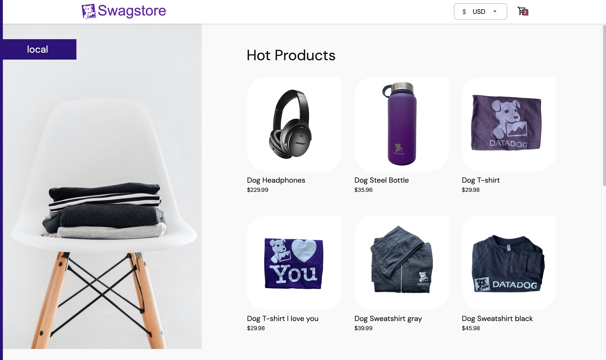
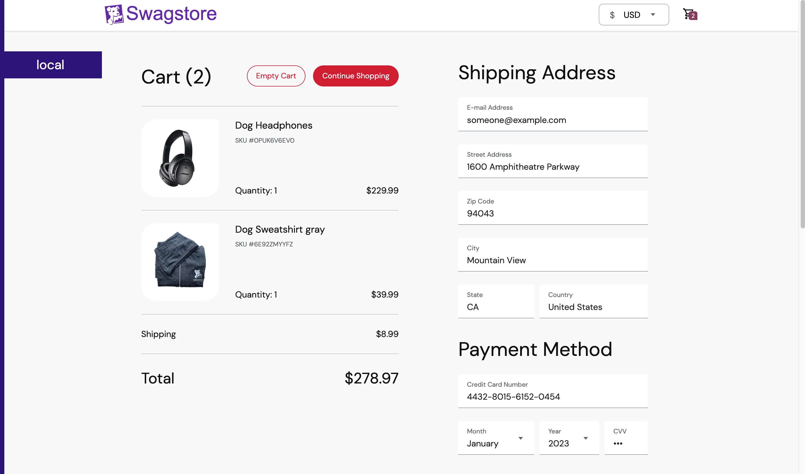

<p align="center">

</p>

# DPN Tears of SRE Microservices - Swagstore

The Swagstore app consists of a 12-tier microservices application. The application is a web-based e-commerce app where users can browse items, add them to the cart, and purchase them.

It is a fictitious e-commerce swag store, don't expect to receive swags :grinning:

## Table of Contents

- [Quick Start](#quick-start)
- [Environment Variables](#environment-variables)
- [Features](#features)
- [Screenshots](#screenshots)
- [Architecture](#architecture)
- [How to Use](#how-to-use)
- [Rebuilding Services](#rebuilding-the-services)
- [About](#about)
- [Contributing](#contributing)
- [License](#license)

## Quick Start

### Prerequisites

**Auto-instrumentation Setup Required**: To get all applications to report data to Datadog, an auto-instrumentation step is required for both local Docker and production deployments.

**⚠️ macOS Compatibility**: Auto-instrumentation is currently **not compatible with macOS Docker**. macOS users should use alternative monitoring setups.

### Step 1: Auto-instrumentation Installation

**Note:** We tested this on a Linux platform. For other platforms or the latest auto-instrumentation commands, refer to [this page](https://app.datadoghq.com/fleet/install-agent/latest).

```bash
DD_API_KEY=XXXXXXXXXXXXXXXXXXXXXXXXXXXXXXXX \
DD_SITE="datadoghq.com" \
DD_APM_INSTRUMENTATION_ENABLED=host \
DD_REMOTE_UPDATES=true \
DD_RUNTIME_SECURITY_CONFIG_ENABLED=true \
DD_SBOM_CONTAINER_IMAGE_ENABLED=true \
DD_SBOM_HOST_ENABLED=true \
DD_ENV=tsreenv \
DD_APM_INSTRUMENTATION_LIBRARIES=java:1,python:3,js:5,php:1,dotnet:3,ruby:2 \
bash -c "$(curl -L https://install.datadoghq.com/scripts/install_script_agent7.sh)"
```

### Step 2: Run the Application (Docker)

After completing the auto-instrumentation setup above:

```bash
# Clone the repository
git clone <repository-url>
cd tsre-microservices

# Set required environment variables
export DD_API_KEY=your_datadog_api_key_here
export DD_APP_KEY=your_datadog_app_key_here

# Build and start all services
docker-compose build 
docker-compose up -d
```

The frontend will be available at [http://localhost](http://localhost).

## Environment Variables

The following environment variables are required to run the application:

### Required Variables

| Variable | Description |
|----------|-------------|
| `DD_API_KEY` | Your Datadog API key for monitoring and observability |
| `DD_APP_KEY` | Your Datadog Application key (required for loggenerator service) |

### Optional Variables

| Variable | Description | Default Value |
|----------|-------------|---------------|
| `CTHULHU_URL` | Optional URL for Cthulhu integration in payment service | Not set |
| `DD_ENV` | Environment name for Datadog | `tsreenv` |
| `DD_SITE` | Datadog site URL | `datadoghq.com` |

### Setting Environment Variables

You can set environment variables in several ways:

1. **Using a `.env` file** (recommended for local development):
   ```bash
   # Create a .env file in the project root
   echo "DD_API_KEY=your_api_key_here" > .env
   echo "DD_APP_KEY=your_app_key_here" >> .env
   ```

2. **Using environment variable exports**:
   ```bash
   export DD_API_KEY=your_api_key_here
   export DD_APP_KEY=your_app_key_here
   ```

3. **Inline with docker-compose**:
   ```bash
   DD_API_KEY=your_api_key_here DD_APP_KEY=your_app_key_here docker-compose up -d
   ```

**Note:** The Datadog API and Application keys are required for proper monitoring and observability features. You can obtain these keys from your [Datadog account settings](https://app.datadoghq.com/organization-settings/api-keys).

## Features
- **[gRPC](https://grpc.io):** Microservices use a high volume of gRPC calls to communicate to each other.
- **[Istio](https://istio.io):** Application works on Istio service mesh.
- **[Cloud Operations (Stackdriver)](https://cloud.google.com/products/operations):** Many services are instrumented with **Profiling**, **Tracing** and **Debugging**. In addition to these, using Istio enables features like Request/Response **Metrics** and **Context Graph** out of the box. When it is running out of Google Cloud, this code path remains inactive.
- **[Skaffold](https://skaffold.dev):** Application is deployed to Kubernetes with a single command using Skaffold.
- **Synthetic Load Generation:** The application demo comes with a background job that creates realistic usage patterns on the website using [Locust](https://locust.io/) load generator.

**At Datadog we use the app to experiment with APM, Tracing Libraries, Admission Controller and auto injection. It is perfect as a playground if you want to play and instrument the microservices written in multiple languages.**

If you're using this demo, please **★Star** this repository to show your interest!

## Screenshots

| Home Page                                                                                                         | Checkout Screen                                                                                                    |
| ----------------------------------------------------------------------------------------------------------------- | ------------------------------------------------------------------------------------------------------------------ |
| [](./docs/img/online-boutique-frontend-1.png) | [](./docs/img/online-boutique-frontend-2.png) |


## Architecture

The application is running in docker.

[](./docs/img/arch.png)


| Service                                              | Language      | Description                                                                                                                       |
| ---------------------------------------------------- | ------------- | --------------------------------------------------------------------------------------------------------------------------------- |
| [frontend](./src/frontend)                           | Go            | Exposes an HTTP server to serve the website. Does not require signup/login and generates session IDs for all users automatically. |
| [cartservice](./src/cartservice)                     | C#            | Stores the items in the user's shopping cart in Redis and retrieves it.                                                           |
| [productcatalogservice](./src/productcatalogservice) | Go            | Provides the list of products from a JSON file and ability to search products and get individual products.                        |
| [currencyservice](./src/currencyservice)             | Node.js       | Converts one money amount to another currency. Uses real values fetched from European Central Bank. It's the highest QPS service. |
| [paymentservice](./src/paymentservice)               | Java          | Charges the given credit card info (mock) with the given amount and returns a transaction ID.                                     |
| [paymentdbservice](./src/paymentdbservice)           | MariaDB       | Stores all charges and payment information according to a transaction ID.                                                         |
| [shippingservice](./src/shippingservice)             | Go            | Gives shipping cost estimates based on the shopping cart. Ships items to the given address (mock)                                 |
| [emailservice](./src/emailservice)                   | Python        | Sends users an order confirmation email (mock).                                                                                   |
| [checkoutservice](./src/checkoutservice)             | Go            | Retrieves user cart, prepares order and orchestrates the payment, shipping and the email notification.                            |
| [recommendationservice](./src/recommendationservice) | Python        | Recommends other products based on what's given in the cart.                                                                      |
| [adservice](./src/adservice)                         | Java          | Provides text ads based on given context words.                                                                                   |
| [loadgenerator](./src/loadgenerator)                 | Python/Locust | Continuously sends requests imitating realistic user shopping flows to the frontend.                                              |


## How to Use

> **Note:** If you are running the Datadog Cluster Agent locally (e.g., via Docker) or on Google Cloud, ensure that certain settings, such as `datadog.networkMonitoring.enabled`, are disabled.

#### Service Configuration
All service configurations are available in the `docker-compose.yml` file. You can modify individual service settings by editing the environment variables in this file.

### Troubleshooting

#### Common Issues
- **Services not starting**: Ensure all required environment variables are set (see [Environment Variables](#environment-variables) section)
- **No data in Datadog**: Verify that auto-instrumentation was completed successfully before starting Docker services
- **macOS compatibility**: Auto-instrumentation is not compatible with macOS Docker - use alternative monitoring setups

#### Accessing Services
- **Frontend**: [http://localhost](http://localhost)
- **Individual services**: Check the `docker-compose.yml` file for specific port mappings

#### Logs
To view logs for all services:
```bash
docker-compose logs -f
```

To view logs for a specific service:
```bash
docker-compose logs -f <service-name>
```

## Rebuilding the Services

To rebuild services after making code changes in the `src` directory:

1. Ensure that your IAM user in the DPN Network IAM has read/write access to the Public ECR Registry (e.g., AWS user).

2. Authenticate Docker with your IAM user on your local machine (replace `<Username>` and `<Password>`):
```bash
aws ecr-public get-login-password --region us-east-1 | docker login --username <Username> --password-stdin <Password>
```

3. Rebuild the images (replace `<tag-name>` as needed). Run these commands from the `tsre-microservices` directory:
```bash
docker buildx build --platform linux/amd64,linux/arm64 -t public.ecr.aws/v6x4t1k2/adservice:<tag-name> --push src/adservice/
docker buildx build --platform linux/amd64,linux/arm64 -t public.ecr.aws/v6x4t1k2/cartservice:<tag-name> --push src/cartservice/
docker buildx build --platform linux/amd64,linux/arm64 -t public.ecr.aws/v6x4t1k2/checkoutservice:<tag-name> --push src/checkoutservice/
docker buildx build --platform linux/amd64,linux/arm64 -t public.ecr.aws/v6x4t1k2/currencyservice:<tag-name> --push src/currencyservice/
docker buildx build --platform linux/amd64,linux/arm64 -t public.ecr.aws/v6x4t1k2/emailservice:<tag-name> --push src/emailservice/
docker buildx build --platform linux/amd64,linux/arm64 -t public.ecr.aws/v6x4t1k2/loadgenerator:<tag-name> --push src/loadgenerator/
docker buildx build --platform linux/amd64,linux/arm64 -t public.ecr.aws/v6x4t1k2/paymentdbservice:<tag-name> --push src/paymentdbservice/
docker buildx build --platform linux/amd64,linux/arm64 -t public.ecr.aws/v6x4t1k2/productcatalogservice:<tag-name> --push src/productcatalogservice/
docker buildx build --platform linux/amd64,linux/arm64 -t public.ecr.aws/v6x4t1k2/recommendationservice:<tag-name> --push src/recommendationservice/
docker buildx build --platform linux/amd64,linux/arm64 -t public.ecr.aws/v6x4t1k2/shippingservice:<tag-name> --push src/shippingservice/
```

4. Update the `spec.template.spec.containers.image` in the respective `tsre-microservices/ctf/<servicename>.yaml` file with the appropriate tag.

## About

**Swagstore** is a heavily modified version of the original [Google Online Boutique](https://github.com/GoogleCloudPlatform/microservices-demo), specifically adapted for Datadog's experimentation with APM, tracing libraries, and microservices instrumentation. The items featured in the Swagstore are actually Datadog swag items.

## Contributing

If you would like to contribute features or fixes to this app, please see the development guidelines and submit a pull request.

## License

This project is based on Google's Online Boutique demo application.